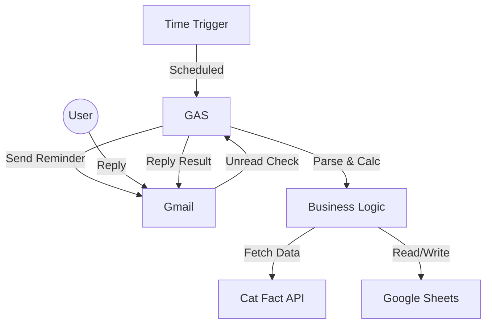

# 🐱 cat-weight-manager-gas

**Google Apps Script (GAS)** と **Gmail** を活用した、サーバーレスな猫の体調・給与管理システムです。
専用アプリは不要。いつものメール返信だけで、愛猫の体重管理、給与量計算、そして健康アドバイスの受信が完結します。

 

## 🚀 Features

* **メールベースのUI**: アプリのインストール不要。Gmailへの返信だけで操作完了。
* **スマートな記録機能**:
    * 空メール返信 → 「ごはん完了」のみ記録
    * 数値入り返信（例: `4.5`） → 「体重記録」＋「ごはん完了」として記録
* **自動計算ロジック**:
    * 猫の代謝エネルギー（RER/DER）に基づいた推奨給与量の自動算出
    * 目標体重までの差異と期限までの残り日数を計算
* **AIアドバイス & トリビア**:
    * 体重超過時にはダイエットアドバイスを表示
    * 通常時には「世界の猫豆知識（Cat Fact API）」を翻訳して配信
* **堅牢な設計**:
    * Repositoryパターン / Service層を採用した保守性の高いアーキテクチャ
    * 文字化けを防ぐセーフティなテキストフォーマット（顔文字対応）

## 🛠 Architecture



## 📦 Setup

### 1. Google Spreadsheet の準備
新規スプレッドシートを作成し、以下の2つのシート（タブ）を作成します。

#### シート名: `設定`
システムの設定値を管理します。

| 行 | A列 (Key) | B列 (Value) | 備考 |
|:---:|:---|:---|:---|
| 2 | 猫の名前 | タマ | |
| 3 | 現在の体重 | 4.5 | 自動更新されます |
| 4 | 目標体重 | 4.0 | |
| 5 | 目標達成期限 | 2025/12/31 | |
| 6 | アラート閾値 | 0.3 | 目標+この値を超えると警告 |
| 7 | フードカロリー | 350 | kcal/100g |
| 8 | 活動係数 | 1.2 | 去勢済成猫=1.2など |
| 9~ | 給与時間 | 06:30 | B列に時間を列挙（複数可） |

#### シート名: `記録`
1行目に見出し（日時, アクション, 体重, アドバイス）を作成してください。データは自動で追記されます。

### 2. Google Apps Script のデプロイ
1.  スプレッドシートのメニューから `拡張機能` > `Apps Script` を開く。
2.  このリポジトリの `main.js` (または `code.gs`) の内容をコピペする。
3.  **重要**: コード冒頭の `SHEET_ID` を、作成したスプレッドシートのIDに書き換える。

```javascript
const CONFIG = {
  SHEET_ID: 'YOUR_SPREADSHEET_ID_HERE', 
  // ...
};
```

### 3. トリガーの設定
GASのエディタ左側のメニュー「トリガー（時計アイコン）」より以下を設定します。

| 関数名 | イベントのソース | タイプ | 間隔 |
|:---|:---|:---|:---|
| `timeBasedTrigger` | 時間主導型 | 分ベース | 1分おき (または10分) |
| `checkMailAndRecord` | 時間主導型 | 分ベース | 1分おき |

## 📝 Usage

### リマインダー受信時
設定した時間になると、`ごはんの時間だニャ` というメールが届きます。

### 記録・返信パターン
このメールに対して「返信」を行ってください。

1.  **ごはんだけあげた場合**
    * 本文なし（または適当な文字）で返信
    * Bot応答: `[記録OK] ごはん完了だニャ♪` + 猫の豆知識

2.  **体重も測った場合**
    * 本文に `4.5` のように数字を入れて返信
    * Bot応答: `[記録OK]` + 以下の分析データ
        * 現在の体重・目標差
        * 期限までの残り日数
        * 今日の推奨給与量（g）

## 💻 Tech Stack
* **Runtime**: Google Apps Script (V8 Engine)
* **Database**: Google Spreadsheet
* **Interface**: Gmail
* **External API**: Cat Fact API, Google Translate API

## ⚠️ Note
* `SHEET_ID` は機密情報です。GitHub等のパブリックな場所にコードを上げる際は、必ずIDを削除またはダミー文字列に置換してください。

## 👤 Author
* Created by [SN1223221-HR]
